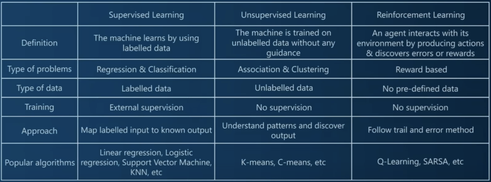
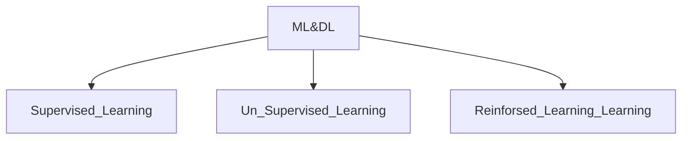
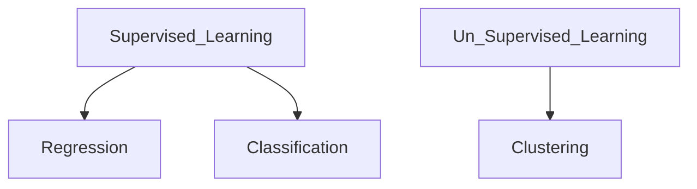

# AI Applications

- AI applications are designed to perform tasks autonomously, without requiring human intervention.
- Common applications include movie recommendations and self-driving cars.

# Machine Learning

- Machine learning is a subset of AI.
- It involves using statistical techniques to analyze, visualize, predict, and forecast data.

## Deep Learning

- Deep learning is a subset of machine learning.
- It aims to mimic the human brain's ability to learn and implement tasks.
- Deep learning models typically consist of multi-layered neural networks, allowing them to learn complex patterns and representations.

### Supervised Learning:

- **Definition**: Supervised learning is a type of machine learning where the algorithm learns from labeled data, which means it is provided with input-output pairs.
- **Input**: The algorithm is trained on a dataset where each example is accompanied by a corresponding label or target output.
- **Objective**: The objective is to learn a mapping from inputs to outputs so that the algorithm can make predictions or classify new unseen data.
- **Examples**: Classification (e.g., spam detection, image recognition) and regression (e.g., house price prediction) are common tasks in supervised learning.

### Unsupervised Learning:

- **Definition**: Unsupervised learning is a type of machine learning where the algorithm learns from unlabeled data, meaning it does not have explicit output labels.
- **Input**: The algorithm is provided with input data only, without any corresponding output labels or targets.
- **Objective**: The objective is to find patterns, structures, or relationships in the data without explicit guidance or supervision.
- **Examples**: Clustering (e.g., grouping similar documents or customers), dimensionality reduction (e.g., feature extraction), and anomaly detection are common tasks in unsupervised learning.

In summary, the main difference between supervised and unsupervised learning lies in the presence or absence of labeled data and the respective objectives of learning from labeled versus unlabeled information.

### Regression:

- **Definition**: Regression is a type of supervised learning task where the goal is to predict a continuous value output based on input features.
- **Output**: The output variable in regression is a real or continuous value. For example, predicting house prices, stock prices, or temperature.
- **Evaluation**: Regression models are evaluated using metrics such as Mean Squared Error (MSE), Root Mean Squared Error (RMSE), Mean Absolute Error (MAE), etc.
- **Examples**: Predicting house prices based on features like square footage, number of bedrooms, and location. Forecasting sales revenue based on advertising spending and other factors.

### Classification:

- **Definition**: Classification is a type of supervised learning task where the goal is to categorize input data into one of several predefined classes or categories.
- **Output**: The output variable in classification is a discrete label or category. For example, classifying emails as spam or not spam, predicting whether a transaction is fraudulent or legitimate, or identifying the species of a plant based on its features.
- **Evaluation**: Classification models are evaluated using metrics such as accuracy, precision, recall, F1-score, etc., depending on the specific problem and the balance between different types of classification errors.
- **Examples**: Identifying whether an image contains a cat or a dog, predicting whether a patient has a particular disease based on medical test results, classifying customer reviews as positive, negative, or neutral.

In summary, while both regression and classification are types of supervised learning, they differ in terms of the nature of the output variable they predict: continuous for regression and categorical for classification. The choice between regression and classification depends on the nature of the problem and the type of output desired.

### Clustering:

- **Definition**: Clustering is an unsupervised learning technique that involves organizing data points into groups or clusters such that data points in the same cluster are more similar to each other than to those in other clusters.
- **Algorithms**: There are various clustering algorithms available, each with its own strengths and weaknesses. Some popular clustering algorithms include K-means clustering, hierarchical clustering, DBSCAN (Density-Based Spatial Clustering of Applications with Noise), and Gaussian Mixture Models (GMM).

### NEXT - [Linear Regression](./LinerRegression.md)
