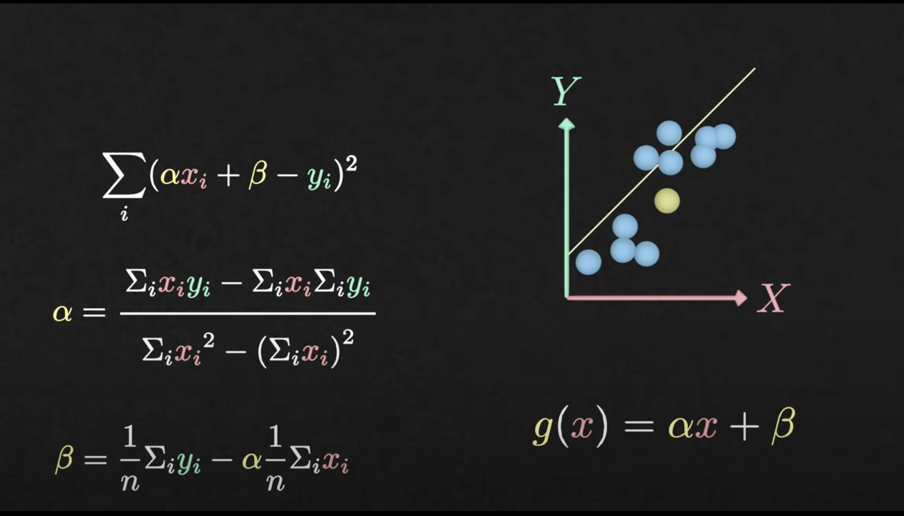

# Linear Regression

- **_[Youtube Video](https://youtu.be/CtsRRUddV2s)_**
- **_[Article IBM](https://www.ibm.com/topics/linear-regression)_**



```py
from sklearn.linear_model import LinearRegression

# regression model
reg = LinearRegression()
# data
X = [[1],[2],[3],[4],[5],[6]]
Y = [2, 2.5, 4.5, 3, 5, 4.7]

# fit
reg.fit(X, Y)

# predict
print(reg.predict([[5.5]]))
```
